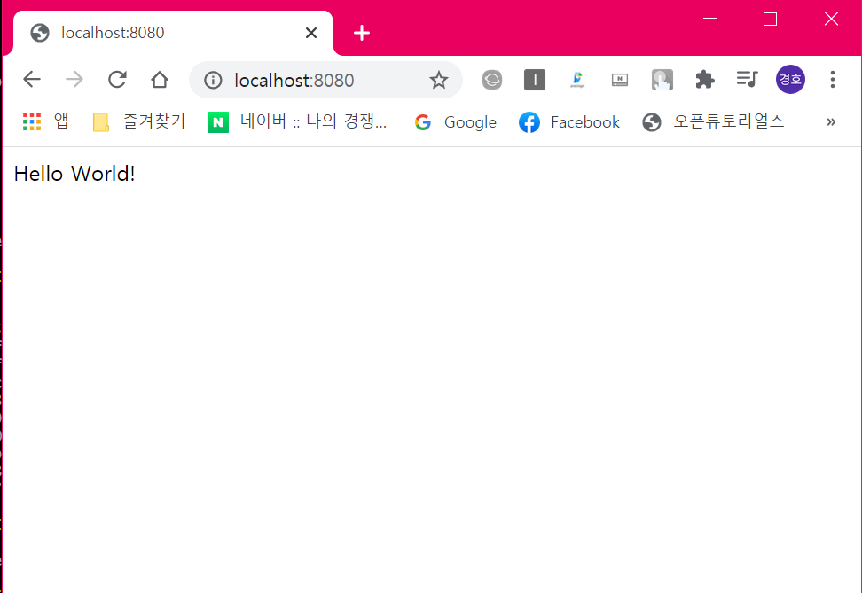

# spring-boot-docker
Docker를 이용해 Spring Boot 어플리케이션을 이미지로 빌드하는 법을 배웁니다.

## 간단한 Controller 생성

```java
package com.springdocker.demo;

import org.springframework.boot.SpringApplication;
import org.springframework.boot.autoconfigure.SpringBootApplication;
import org.springframework.web.bind.annotation.GetMapping;
import org.springframework.web.bind.annotation.RestController;

@SpringBootApplication
@RestController
public class SpringdockerdemoApplication {

	@GetMapping("/")
	public String hello() {
		return "Hello World!";
	}

	public static void main(String[] args) {
		SpringApplication.run(SpringdockerdemoApplication.class, args);
	}
}
```

잘 작동하는지 확인을 위해 메이븐 패키징으로 jar 파일을 생성

```powershell
$ mvn package
```

그 후 실행해봄

```powershell
$ java -jar target/spring-boot-docker-0.0.1-SNAPSHOT.jar
```

Docker 컨테이너로 이용하기 위해 도커 이미지를 생성해야함. 그러기 위해서 먼저

## Dockerfile을 생성

```docker
FROM openjdk:8-jre
COPY target/spring-boot-docker-*.jar app.jar
ENTRYPOINT ["java", "-jar", "app.jar"]
```

- base가 되는 이미지가 필요한데 openjdk:8-jre를 베이스 이미지로 설정함
- Base가 되는 이미지를 COPY할 이미지를 설정
- ENTRYPOINT로 command를 java -jar app.jar 로 줌

## 도커파일을 이용해 이미지를 빌드
아래 명령어를 사용하여 Dockerfile을 이용해 이미지를 빌드해보자.

```powershell
$ docker build -t spring-boot-docker .
```

- . 은 현재 경로에 도커파일이 있음을 알려줌

빌드된 이미지를 확인

```powershell
$ docker images
REPOSITORY                   TAG                 IMAGE ID            CREATED             SIZE
spring-boot-docker           latest              f60364dd13c7        15 seconds ago      265MB
kyeongho/docker101tutorial   latest              ffd4a1c7ad5c        27 minutes ago      26.5MB
docker101tutorial            latest              ffd4a1c7ad5c        27 minutes ago      26.5MB
node                         12-alpine           057fa4cc38c2        7 days ago          89.3MB
openjdk                      8-jre               b1b24a1b2834        4 weeks ago         265MB
python                       alpine              8ecf5a48c789        4 weeks ago         78.9MB
nginx                        alpine              7d0cdcc60a96        5 weeks ago         21.3MB

```

이미지를  실행하여 잘 동작하는지 확인해보자.

```powershell
$ docker run -d -p 8080:8080 spring-boot-docker
```

브라우저로 [localhost:8080](http://localhost:8080) 으로 연결이 가능함을 확인



## maven docker plugin 활용

maven docker plugin 을 검색해보면 spotify와 fabric 두 가지가 나오는데 fabric이 좀 더 디테일하고 잘 만들어졌다함.

```xml
			<plugin>
				<groupId>io.fabric8</groupId>
				<artifactId>docker-maven-plugin</artifactId>
				<version>0.33.0</version>
				<configuration>
					<images>
						<image>
							<name>kyeongho/spring-boot-docker</name>
							<build>
								<dockerFileDir>${basedir}</dockerFileDir>
							</build>
						</image>
					</images>
				</configuration>
			</plugin>
```

[fabric8io/docker-maven-plugin](http://dmp.fabric8.io/#installation)

- fabic의 document에 installation을 참고하여 설정해준다.
- name 태그에는 이미지 이름 앞에 자신의 user name을 적어준다.
- dockerFileDir 태그는 src/main/docker가 기본 루트로 설정돼있는데 보통 Dockerfile은 project의 root에 위치해있는 경우가 많기 때문에 ${basedir}라는 환경변수를 활용해 Dockerfile의 경로를 project의 기본 경로로 설정해준다.

아래 명령어를 활용해 플러그인이 잘 동작하는지 확인해본다.

```xml
$ mvn docker:build
```

후에 도커 이미지가 잘 생성됐는지 확인 해보면

```xml
$ docker images
REPOSITORY                    TAG                 IMAGE ID            CREATED             SIZE
kyeongho/spring-boot-docker   latest              197863661358        11 seconds ago      281MB
spring-boot-docker            latest              53f47420441e        13 minutes ago      281MB
kyeongho/docker101tutorial    latest              ffd4a1c7ad5c        5 hours ago         26.5MB
docker101tutorial             latest              ffd4a1c7ad5c        5 hours ago         26.5MB
node                          12-alpine           057fa4cc38c2        7 days ago          89.3MB
openjdk                       8-jre               b1b24a1b2834        4 weeks ago         265MB
python                        alpine              8ecf5a48c789        4 weeks ago         78.9MB
nginx                         alpine              7d0cdcc60a96        5 weeks ago         21.3MB
```

위와 같이 kyeongho/spring-boot-docker 라는 이름으로 이미지가 잘 생성된 것을 확인할 수 있다.

## 메이븐 패키지에 docker:build 끼워넣기

매번 mvn docker:build를 통해 이미지를 생성하기엔 번거로움이 있기에 mvn package만 해주면 메이븐 패키징과 함께 도커 이미지가 빌드되게 해줄 수 있다.

먼저 target 디렉토리에 있는 것들을 클린 패키징을 통해 깔끔하게 해주고 생성했던 도커 이미지를 삭제해주자.

```powershell
$ mvn clean
$ docker rmi kyeongho/spring-boot-docker
```

그 후 pom.xml에 execution 태그를 추가 설정하여 메이븐 패키지 페이즈에 도커 빌드를 끼워넣어 함께 실행되게 한다.

```xml
			<plugin>
				<groupId>io.fabric8</groupId>
				<artifactId>docker-maven-plugin</artifactId>
				<version>0.33.0</version>
				<configuration>
					<images>
						<image>
							<name>kyeongho/spring-boot-docker</name>
							<build>
								<dockerFileDir>${basedir}</dockerFileDir>
							</build>
						</image>
					</images>
				</configuration>
				<executions>
					<execution>
						<id>docker-build</id>
						<phase>package</phase>
						<goals>
							<goal>build</goal>
						</goals>
					</execution>
				</executions>
			</plugin>
```

설정 후 mvn package를 통해 빌드하면 jar 파일이 먼저 생긴 후 도커 이미지가 빌드되어 생성되는 것을 볼 수 있다.

```powershell
$ mvn package
```

이후 이미지가 제대로 생성됐는지 확인해보자.

```powershell
$ docker images
REPOSITORY                    TAG                 IMAGE ID            CREATED             SIZE
kyeongho/spring-boot-docker   latest              5cb55ec5f57a        17 seconds ago      281MB
spring-boot-docker            latest              53f47420441e        28 minutes ago      281MB
kyeongho/docker101tutorial    latest              ffd4a1c7ad5c        5 hours ago         26.5MB
docker101tutorial             latest              ffd4a1c7ad5c        5 hours ago         26.5MB
node                          12-alpine           057fa4cc38c2        7 days ago          89.3MB
openjdk                       8-jre               b1b24a1b2834        4 weeks ago         265MB
python                        alpine              8ecf5a48c789        4 weeks ago         78.9MB
nginx                         alpine              7d0cdcc60a96        5 weeks ago         21.3MB
```

kyeongho/spring-boot-docker라는 이름으로 이미지가 잘 생성된 것을 볼 수 있다.

이미지 실행 후에 동작을 확인해보면 아주 잘 동작하는 것을 확인할 수 있다!

```powershell
$ docker run -d -p 8080:8080 kyeongho/spring-boot-docker
```


## plugin을 활용해 공용 저장소에 push 하기

추가적으로 mvn docker:push 커맨드를 사용하면 자신의 docker hub에 생성된 image를 올릴 수도 있다.

```powershell
$ mvn docker:push
```


이를 활용하면 검증된 패키지를 도커 이미지로 빌드할 수 있고, 해당 이미지를 공용 저장소에 push할 수 있다. 그러면 누구든지 어디서든 공용 저장소에서 해당 이미지를 받아 테스트를 하거나 배포를 할 수 있게 된다!
